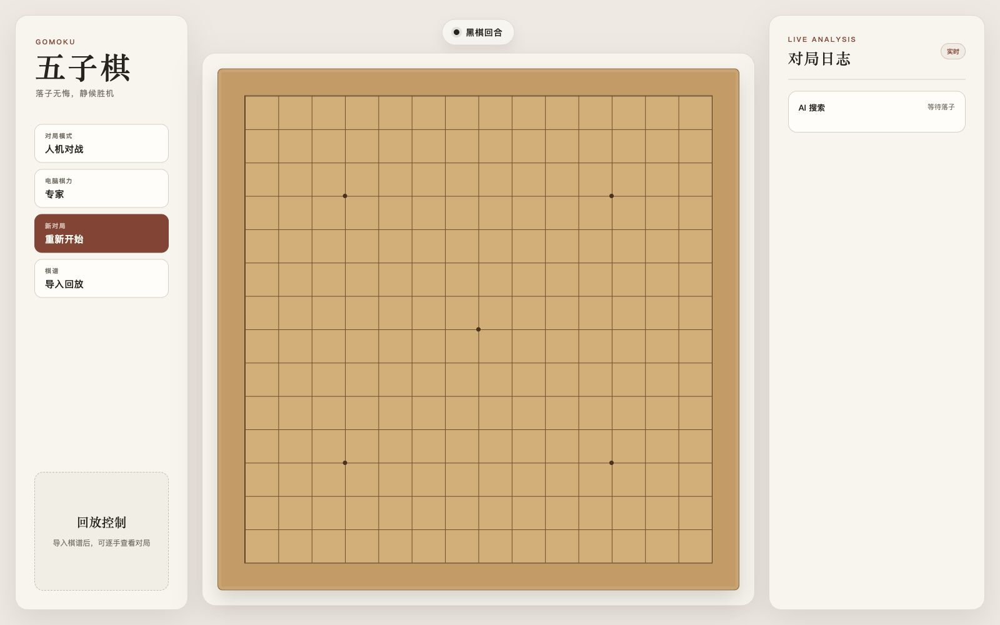

# Gomoku Expert AI

一个运行在浏览器中的 15×15 自由五子棋项目，支持双人对战、三级 AI、棋谱导入回放，以及专家 AI 失败棋谱回归。

> 本项目中的“AI”指通过棋型评估、局面搜索、威胁分析等传统算法实现的棋手程序，全部在浏览器本地运行，不依赖大语言模型或在线 AI 服务。

[在线体验](https://jarvin-lab-gomoku.pages.dev/)



## 功能

- 双人对战和人机对战
- 休闲、进阶、专家三个 AI 等级
- VCF/VCT、短杀、威胁空间与多杀源防守搜索
- 开局体系、厚势、连接、封锁、先手权和多威胁源评估
- Web Worker 后台搜索，避免阻塞棋盘交互
- JSON 棋谱下载、导入和逐手回放
- 专家 AI 败局自动分类为回归 fixture

三档 AI 形成明确梯度：休闲级以快速局部判断为主；进阶级增加三层评分搜索与短杀攻防；专家级进一步启用开局定式、威胁空间和 VCF/VCT 搜索。

专家级单手总搜索预算为 10 秒，并优先分配给 VCF 防守和威胁空间拆解；超时时返回最后完成验证的候选。

搜索内核使用确定性 64 位 Zobrist Hash、可撤销原地落子和带 Alpha-Beta 边界的置换表；回归测试会同时检查缓存命中与搜索结束后的棋盘完整性。

普通评分搜索在叶节点继续延伸两层活三、冲四等强制手；威胁空间会依据候选密度动态验证最多四条并行计划，降低单计划遗漏和战术地平线效应。

## 游戏规则

本项目采用 15×15 自由五子棋规则：黑棋先手，任意一方横、竖或斜线形成连续五子即获胜。当前不包含连珠规则中的三三、四四、长连等黑棋禁手。

## 本地开发

需要 Node.js `^20.19.0` 或 `>=22.12.0`。

```bash
npm install
npm run dev
```

Vite 会输出本地访问地址。

## 测试与构建

```bash
npm test
npm run check
npm run build
npm run preview
```

测试包括棋型评分、战术应手、开局识别、VCF/VCT、威胁空间防守和专家失败 fixture 回归；`check` 用于检查应用入口与 AI 模块的 JavaScript 语法。

## 工程结构

```text
src/
  app/                 浏览器应用层：DOM、棋盘视图、规则、Worker、棋谱
  modules/
    ai.js              AI 公共入口与决策编排
    ai/                棋型、候选、搜索、开局和局面评估
  main.js              应用启动与状态协调
public/
  favicon.svg           站点图标
tests/
  fixtures/            专家 AI 实战失败棋谱库
  ai-regression.mjs    AI 行为回归
  expert-fixtures.mjs  Fixture 结构与修复验证
```

## 专家失败棋谱

玩家击败专家 AI 后，应用会生成 `expert-loss-fixture`，按以下类型分类：

- 误判棋型
- 漏防双杀
- 漏算 VCF
- 防守次序错误
- 开局劣势

下载 fixture 后，将 JSON 放入 `tests/fixtures/expert-losses/<category>/`，再运行 `npm test` 即可纳入后续回归。Schema v2 会同时记录根因位置和多标签，并验证防后双杀、直接胜点、限定深度强制杀及 10 秒时间预算。

## GitHub Actions

仓库包含 CI 工作流。推送到 `main` 或创建 Pull Request 时，会自动执行语法检查、测试和构建。

## 第三方来源

开局形状的来源和使用边界见 [THIRD_PARTY_NOTICES.md](./THIRD_PARTY_NOTICES.md) 与 [开局数据说明](./src/modules/ai/OPENING_BOOK_SOURCE.md)。

## License

[MIT](./LICENSE)
